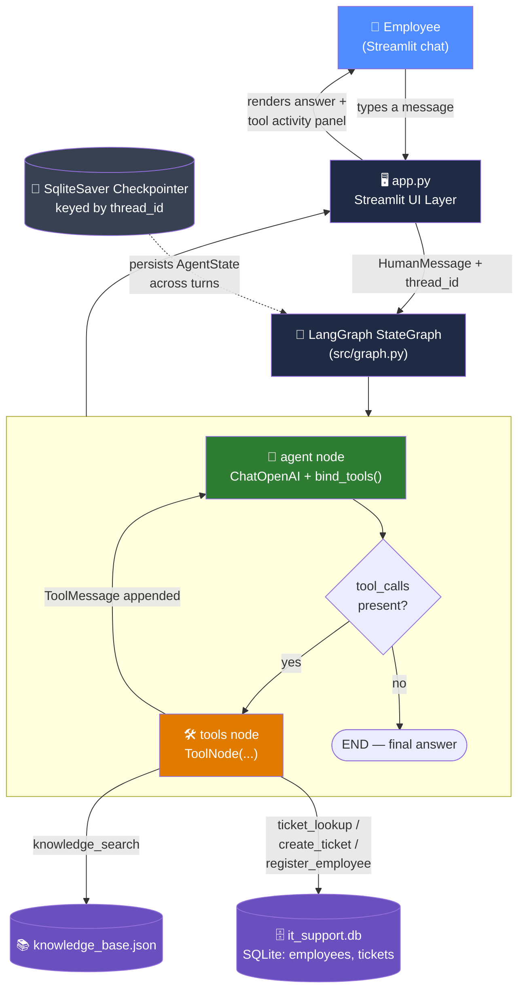
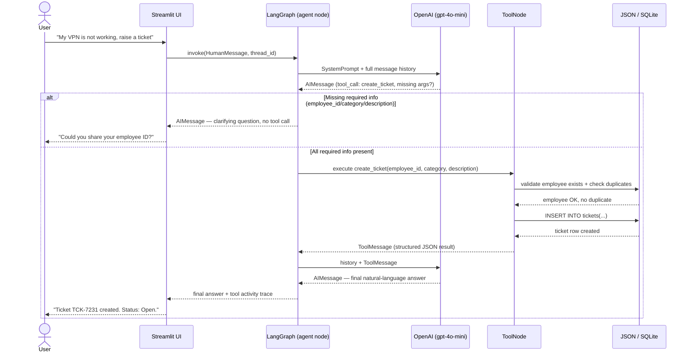
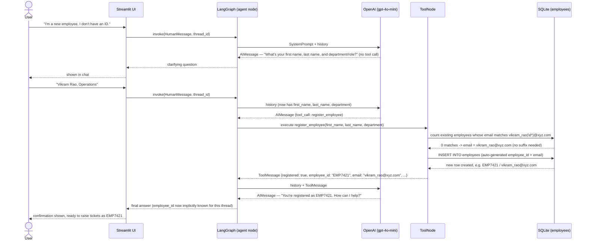
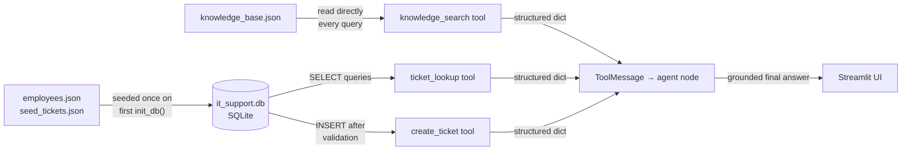

# System Architecture — 🧞 SupportGenie (AI IT Support Assistant)

A deep dive into how this agentic AI system is built: every component, every
technology choice and *why* it was chosen, and the full request lifecycle
from a user's message to a grounded, tool-backed response.

---

## 1. High-Level Architecture



**In one sentence:** a user message enters a LangGraph loop where an
LLM decides whether it needs a tool, a tool node runs exactly the tool(s)
requested against local JSON/SQLite data, and the loop repeats until the
LLM is ready to produce a final, grounded, natural-language answer — with
the entire conversation's state persisted so context carries across turns.

---

## 2. Full Request Lifecycle (Sequence)



This is the "state → routing → multi-step workflow" the project brief asks
the agent to demonstrate: the agent doesn't blindly call a tool — it can
also choose to ask a clarifying question, loop back after seeing a tool's
result, and only then produce its final response.

### 2.1 New-Employee Onboarding Flow

The seeded `employees.json` is a *starting* directory, not a hard limit. A
fourth tool, `register_employee`, lets the agent create a real employee row
in SQLite on demand — so anyone can register themselves and immediately use
the system as a fully-fledged employee, with no manual database editing:



Because `AgentState.messages` persists across turns via the `SqliteSaver`
checkpointer, the agent doesn't need to ask for the employee ID again for
the rest of the conversation — the next request ("my laptop won't turn on,
raise a ticket") flows straight into `create_ticket` using `EMP7421`.

**Key safety property:** both the `employee_id` *and* the `email` are
*always* generated inside `src/tools.py`/`src/db.py`
(`_build_email_local_prefix()` + `generate_unique_employee_email()`, and
`_generate_employee_id()`), never supplied or invented by the LLM. The user
is only ever asked for **first name, last name, and department/role** — the
email always follows the fixed company format `firstname_lastname@xyz.com`,
and every registered employee gets a guaranteed-unique `EMP####` ID.

**Multiple employees, same name:** the business rule here is that any
number of employees may share an identical first and last name — this is
normal, not an error. `register_employee` therefore *always* creates a new
employee record; it never blocks or refuses on the grounds that the name
already exists. Uniqueness is guaranteed on the **email** instead, by
counting how many existing employees already have an email matching
`firstname_lastname` + optional digits, and appending the next number:

| Registration order | Name | Generated email |
|---|---|---|
| 1st | Jane Doe | `jane_doe@xyz.com` |
| 2nd | Jane Doe | `jane_doe1@xyz.com` |
| 3rd | Jane Doe | `jane_doe2@xyz.com` |

Each still gets its own independent, guaranteed-unique `EMP####` employee
ID — the shared name never causes a clash there.

---

## 3. Component-by-Component Breakdown

### 3.1 `app.py` — Presentation Layer (Streamlit)

**What it does:**
- Renders the chat interface (`st.chat_message`, `st.chat_input`) plus a
  **multi-chat sidebar**: a list of every saved chat (title, most-recently
  updated first), a `➕ New Chat` button, and a `🗑️` delete button next to
  each chat.
- Each chat has its own `chat_id` (row in the `chats` SQLite table, for the
  sidebar/title/rendered history) and its own `thread_id` (key into the
  LangGraph `SqliteSaver` checkpointer, for the agent's actual conversation
  state) — kept as two separate concerns so the UI layer never has to know
  how LangGraph internally represents state.
- Reads and writes chat history through `src/db.py` (`list_chats`,
  `get_chat`, `update_chat`) rather than only `st.session_state`, which is
  what makes chats **survive a full app restart**, not just a browser
  refresh.
- Calls `graph.invoke(...)` on every new message and unpacks the resulting
  message list to find any tool calls + their results, displaying them in a
  collapsible **"🔧 Tool activity"** panel — this makes the agent's reasoning
  transparent instead of a black box.
- Wraps the whole invocation in `try/except` so a failure (e.g. API outage,
  malformed tool output) surfaces as a friendly error message instead of
  crashing the app.
- `🗑️` permanently deletes a chat: removes its row from the `chats` table
  *and* calls `delete_thread_state()` to purge its LangGraph checkpoint data
  from `checkpoints.db`, so nothing lingers after deletion.

**Why Streamlit:** the brief explicitly recommends it for a "simple, clean
interface" with chat, history, reset, and tool-visibility requirements —
Streamlit provides all of this with minimal boilerplate, letting the project
focus on the agent logic rather than frontend engineering.

### 3.2 `src/config.py` — Configuration Layer

**What it does:** loads `OPENAI_API_KEY`, `OPENAI_MODEL`, `LLM_TEMPERATURE`,
and `EMAIL_DOMAIN` from a `.env` file via `python-dotenv`, and centralizes
all file paths (`data/`, `DB_PATH` for `it_support.db`,
`CHECKPOINT_DB_PATH` for `checkpoints.db`, JSON seed files) as constants.

**Why this matters:** no file in the project hard-codes a path, model name,
or secret — everything flows from one place, which is both a code-quality
requirement ("no unnecessary hard-coded values") and makes the system
trivially portable to another model or environment.

### 3.3 `src/db.py` — Persistence Layer (SQLite)

**What it does:**
- Defines three tables: `employees(employee_id, name, email, department)`,
  `tickets(ticket_id, employee_id, category, description, status, created_at)`,
  and `chats(chat_id, thread_id, title, history_json, created_at, updated_at)`
  — the last of which backs the Streamlit sidebar's persistent chat list.
- `init_db()` creates the schema and **seeds it automatically** from
  `data/employees.json` / `data/seed_tickets.json` the very first time the
  app runs — the evaluator never has to prepare data manually.
- Exposes small, focused helper functions (`get_employee`,
  `generate_unique_employee_email`, `create_employee`, `find_tickets`,
  `find_open_ticket_for_duplicate_check`, `create_ticket`, and
  `create_chat` / `list_chats` / `get_chat` / `update_chat` / `delete_chat`)
  that the tools layer and `app.py` call — neither writes raw SQL itself.
- Generates unique, realistic ticket IDs (`TCK-XXXX`) and employee IDs
  (`EMP####`) server-side, each with its own collision check — the LLM never
  invents or supplies these values itself.

**Why SQLite (not just JSON) for this data:** employees and tickets are
naturally *relational* — tickets reference an employee, need to be filtered
by multiple criteria (employee, ticket ID, keyword) and support inserts. A
real database engine expresses this more honestly than hand-rolled JSON
filtering, and it demonstrates a genuinely "local data source" integration
as required by the brief, without needing a server (SQLite is a single
embedded file).

### 3.4 `data/knowledge_base.json` — Reference Data

A flat JSON array of IT knowledge base articles (VPN, hardware, software,
network, account, email topics), each tagged with `keywords` for matching.
**Why plain JSON here:** the knowledge base is static, read-only reference
content — no relationships, no writes — so a database would be unnecessary
overhead. This also keeps a clear contrast with the *dynamic*, writable
ticket data that lives in SQLite.

### 3.5 `src/tools.py` — The Agent's Capabilities

Four tools, each following the same shape: a **Pydantic input schema**
(structured, validated arguments the LLM must fill in), a `@tool`-decorated
function with a docstring that *is* the LLM's instructions for when/how to
call it, and a `try/except` so a failure returns a structured error dict
instead of raising an exception into the graph.

| Tool | Pydantic Schema | Logic | Guardrails |
|---|---|---|---|
| `knowledge_search` | `KnowledgeSearchInput(query)` | Keyword-overlap scoring across KB articles | Returns `found: false` (never fabricates an answer) when nothing matches |
| `ticket_lookup` | `TicketLookupInput(employee_id?, ticket_id?, keyword?)` | Parameterized SQL filter over `tickets` | Requires at least one search criterion |
| `create_ticket` | `CreateTicketInput(employee_id, category, description)` | Validates employee exists → checks for duplicate open ticket in same category → inserts row | Refuses unknown employees; flags likely duplicates instead of silently creating one; normalizes category to a fixed allow-list |
| `register_employee` | `RegisterEmployeeInput(first_name, last_name, department)` | Always creates a new employee — generates a unique company email (`firstname_lastname@xyz.com`, incrementing a numeric suffix if that name is already used) → inserts a new row with a server-generated `EMP####` ID | Refuses incomplete input; never blocks on a shared name (multiple employees can share one); never lets the LLM choose the ID *or* the email |

**Onboarding new employees:** `register_employee` is what makes the system
open-ended rather than limited to the 6 seeded employees — any user can
identify themselves as new, provide **only their first name, last name, and
department/role**, and be inserted into the real `it_support.db` file, after
which `ticket_lookup` and `create_ticket` work for them exactly as they
would for a pre-seeded employee. The agent is explicitly instructed never to
ask for an email address or employee ID — both are generated by the system:
the email follows `firstname_lastname@xyz.com`, automatically incrementing a
numeric suffix if that exact name has been registered before (via
`_build_email_local_prefix()` in `tools.py` + `generate_unique_employee_email()`
in `db.py`), and the ID is a fresh, collision-checked `EMP####` value (via
`_generate_employee_id()` in `db.py`). Registration always succeeds — a
shared name is never treated as a duplicate or an error.

**Why Pydantic schemas specifically:** this is what turns free-text LLM
output into **structured, type-checked function arguments** — the same
"do not just save the raw LLM response" principle the brief calls out for
structured extraction, applied here to structured *tool calls*.

### 3.6 `src/state.py` — Conversation State

```python
class AgentState(TypedDict):
    messages: Annotated[list, add_messages]
    employee_id: Optional[str]
```

`messages` uses LangGraph's `add_messages` reducer, so every node only
returns the *new* messages it produced and LangGraph automatically appends
them to the running history — this is the backbone of both tool-calling
(tool results must be visible to the next LLM call) and conversational
memory (the full exchange is always available).

### 3.7 `src/graph.py` — Orchestration Layer (LangGraph)

This is the heart of the "Agentic AI" requirement. It wires together:

- **`agent` node** — invokes `ChatOpenAI(...).bind_tools(ALL_TOOLS)` with a
  detailed system prompt (see below) plus the full message history, and
  returns whatever the LLM produced — either a tool call or a final answer.
- **`tools` node** — a prebuilt `ToolNode(ALL_TOOLS)` that executes exactly
  the tool call(s) the LLM emitted and appends the result as `ToolMessage`s.
- **Conditional edge** (`tools_condition`) — inspects the last AI message:
  if it contains `tool_calls`, route to `tools`; otherwise route to `END`.
  This is what lets the agent *choose* to ask a clarifying question (no
  tool call → straight to END) instead of always being forced through a
  tool.
- **Loop-back edge** `tools → agent` — after a tool runs, control returns to
  the agent so it can read the tool's result and phrase the final answer in
  natural language (never just dumping raw JSON at the user).
- **`SqliteSaver` checkpointer** — persists the entire `AgentState` keyed by
  a `thread_id` to `data/checkpoints.db`, so state (message history, and by
  extension anything the conversation has established, like an employee ID
  mentioned two turns ago) survives across every `graph.invoke()` call —
  including across a full app restart, not just within one running session.

**The system prompt** is deliberately explicit about safety rules — it's not
just "you have four tools," it's:
- never invent information not confirmed by a tool or the user,
- collect `employee_id` + `description` *before* calling `create_ticket`,
  asking directly for whatever is missing — the LLM classifies the
  `category` itself from the description (see below), it never asks the
  user to pick one,
- if the employee isn't found (or the user says they're new), offer to
  register them via `register_employee`, asking **only** for first name,
  last name, and department/role — never email or employee ID, both of
  which the system generates automatically — then reuse the returned ID for
  the rest of the conversation,
- surface duplicate-ticket warnings to the user instead of silently creating
  a second ticket,
- clearly report tool errors/"not found" results rather than guessing.

**Self-classification, not user classification:** the prompt embeds the
exact `VALID_CATEGORIES` allow-list from `tools.py` and instructs the LLM to
silently pick the best-fitting category itself (e.g. "monitor and keyboard
not working" → `Hardware`) rather than asking the user "what category is
this?" — this keeps the conversation natural while still landing on one of
the fixed, validated category values.

This directly satisfies the brief's "Safety / Validation Requirements"
section — the agent is instructed, and the tools themselves are coded, to
never blindly execute an action on incomplete or ambiguous information.

### 3.8 `src/logging_config.py` — Observability

A single shared logger (`it_support_assistant`) that every module writes to
— DB seeding, tool invocations (with their key arguments), ticket creation,
and any exceptions. Guards against Streamlit's script-rerun model
double-attaching handlers. This satisfies the "basic logging" expectation
and gives a clear audit trail of every decision the agent made.

### 3.9 `tests/test_tools.py` — Verification

Direct, LLM-independent smoke tests for all four tools, covering the happy
path, the "not found" path, the "unknown employee" rejection, duplicate-ticket
detection, successful employee registration (including using the new ID to
immediately create a ticket), the same-name-gets-an-incrementing-email
business rule (three registrations with an identical name, asserting each
gets a distinct `employee_id` and the expected `name@domain` /
`name1@domain` / `name2@domain` email progression), and missing-field
rejection — proving the tool layer is correct in isolation before ever
involving the (non-deterministic) LLM.

---

## 4. Technology Stack — What & Why

| Technology | Role in this project | Why this and not something else |
|---|---|---|
| **Python 3.11+** | Implementation language | Required by the brief; ecosystem for LangGraph/LangChain is Python-first |
| **LangGraph** | Agent orchestration: state, nodes, conditional routing, tool loop | Explicitly required by the brief; makes multi-step agent workflows a visible graph instead of a single opaque LLM call |
| **LangChain Core (`@tool`, Pydantic schemas)** | Tool definitions bound to the LLM | Standard, well-tested pattern for structured function/tool calling that integrates natively with LangGraph's `ToolNode` |
| **langchain-openai (`ChatOpenAI`)** | LLM client with native tool-calling support | OpenAI's function-calling API is reliable and well-supported by LangChain's `bind_tools` |
| **OpenAI API (`gpt-4o-mini`)** | Reasoning: intent understanding, tool selection, final response generation | Small, fast, inexpensive model with strong tool-calling accuracy — no expensive infrastructure required, matching the brief's cost constraint |
| **SQLite** | Employees & tickets storage | Zero-config, single-file relational database — perfect for "local data source" requirements without needing a server |
| **JSON** | Knowledge base + seed data | Static reference data with no relational needs; human-readable and trivially editable for grading |
| **Pydantic** | Tool input validation | Turns free-text LLM tool calls into type-checked, structured arguments — avoids "just saving the raw LLM response" |
| **Streamlit** | Chat UI | Recommended by the brief; fastest path to a clean, functional chat interface with history, reset, and result visibility |
| **python-dotenv** | Environment/secret management | Keeps API keys out of source code and out of version control |
| **Python `logging`** | Observability | Lightweight, standard-library logging satisfying the "basic logging" requirement without extra dependencies |

---

## 5. Data Flow Summary



---

## 6. Why This Design Scores Well Against the Brief

- **"Tool Calling → Agent → State → Routing → Multi-Step Workflow"** — each
  arrow in that phrase maps to a concrete piece of this system: Pydantic
  tool schemas (Tool Calling), the `agent` node (Agent), `AgentState` +
  `SqliteSaver` (State), `tools_condition` (Routing), and the `agent ⇄ tools`
  loop (Multi-Step Workflow).
- **Realistic, local-only scope** — four tools, JSON + SQLite, no external
  services beyond the LLM call itself, runnable entirely on a local machine.
- **Open-ended, not a fixed demo dataset** — the `register_employee` tool
  means the system isn't limited to the 6 seeded employees; any evaluator can
  onboard themselves as a real employee and drive the full ticket lifecycle
  under their own identity.
- **Safety first** — the agent is architecturally prevented from creating a
  ticket with missing or invented information, and is nudged (not forced) to
  confirm before creating a likely duplicate.
- **Transparent by design** — every tool call and its raw result is visible
  in the UI's tool activity panel and in the logs, not hidden inside a
  single LLM response.
